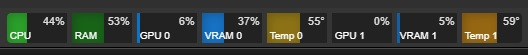

# System Resource Monitor

A standalone Chrome app for real-time system resource monitoring with always-on-top display capabilities.

## Overview

This project extracts and adapts the real-time system monitoring feature from ComfyUI-Crystools into a standalone Chrome application. The app provides live indicators for CPU, RAM, GPU utilization, VRAM usage, and GPU temperature displayed as progress bars in a borderless, always-on-top window.

## Features

- **Real-time Monitoring**: Live updates for system resources
  - CPU utilization percentage
  - RAM usage and total memory
  - GPU utilization (NVIDIA GPUs)
  - VRAM usage and temperature
  - Hard drive usage by drive

- **User Interface**:
  - Borderless Chrome app window
  - Always-on-top mode
  - Resizable and movable across monitors
  - Color-coded progress bars
  - Hover tooltips with detailed information

- **Customization**:
  - Configurable refresh rates (1-30 seconds)
  - Enable/disable individual monitors
  - Adjustable monitor size and position
  - Per-GPU monitoring controls

## Screenshots



## Installation

### Prerequisites

- **Operating System**: Windows 10/11, Linux (Ubuntu 18.04+), macOS 10.15+
- **Python**: 3.8+ with pip package manager
- **NVIDIA GPU**: Optional, for GPU monitoring features
- **Chrome Browser**: For running the app

### Dependencies

Install required Python packages globally (no virtual environment needed):

```bash
pip install -r requirements.txt
```

The requirements include:
- `psutil>=5.8.0` - System monitoring
- `py-cpuinfo>=8.0.0` - CPU information
- `pynvml>=11.4.1` - NVIDIA GPU monitoring
- `aiohttp>=3.8.0` - Web server framework
- `torch>=1.9.0` - CUDA detection (optional)

### Setup

1. Clone this repository:
   ```bash
   git clone https://github.com/growmation21/system_resource_monitor.git
   cd system_resource_monitor
   ```

2. Install dependencies globally:
   ```bash
   pip install -r requirements.txt
   ```
   *Note: No virtual environment required - the app runs with system Python*

3. Run the application:
   ```bash
   python main.py
   ```

## Architecture

### Backend Components

- **`back-end/hardware.py`** - Main hardware information orchestrator
- **`back-end/gpu.py`** - GPU-specific monitoring (NVIDIA support)
- **`back-end/monitor.py`** - Threading and data collection management
- **`back-end/hdd.py`** - Hard drive monitoring utilities

### Frontend Components

- **`front-end/monitor.ts`** - Main monitor controller and settings
- **`front-end/monitorUI.ts`** - UI rendering and real-time updates
- **`front-end/progressBar*.ts`** - Progress bar components
- **`front-end/styles.ts`** - Color definitions and styling
- **`front-end/monitor.css`** - CSS styling

### Data Structure

```python
{
    'cpu_utilization': float,        # CPU usage percentage (0-100)
    'ram_total': int,               # Total RAM in bytes
    'ram_used': int,                # Used RAM in bytes  
    'ram_used_percent': float,      # RAM usage percentage (0-100)
    'hdd_total': int,               # Total disk space in bytes
    'hdd_used': int,                # Used disk space in bytes
    'hdd_used_percent': float,      # Disk usage percentage (0-100)
    'device_type': str,             # GPU device type identifier
    'gpus': [                       # Array of GPU data
        {
            'gpu_utilization': float,    # GPU usage percentage (0-100)
            'gpu_temperature': float,    # GPU temperature in Celsius
            'vram_total': int,          # Total VRAM in bytes
            'vram_used': int,           # Used VRAM in bytes
            'vram_used_percent': float, # VRAM usage percentage (0-100)
        }
    ]
}
```

## Development Status

This project is currently in development. See the [Implementation Plan](implementation-plan.md) for detailed development roadmap and progress tracking.

### Current Phase
- [ ] Phase 1: Project Foundation and Setup
- [ ] Phase 2: Backend Hardware Monitoring
- [ ] Phase 3: WebSocket Communication Layer
- [ ] Phase 4: Frontend UI Development
- [ ] Phase 5: Chrome App Integration
- [ ] Phase 6: Configuration and Settings UI
- [ ] Phase 7: Testing and Validation
- [ ] Phase 8: Documentation and Deployment

## Performance

- **CPU Overhead**: Target <0.5% system utilization
- **Memory Usage**: ~10-20MB for monitoring service
- **Update Frequency**: Configurable 1-30 second intervals
- **Network Traffic**: ~1KB per update cycle

## Platform Support

### Hardware Monitoring
- **CPU**: All platforms via psutil
- **RAM**: All platforms via psutil  
- **Disk**: All platforms via psutil
- **GPU**: NVIDIA GPUs only (CUDA-capable)

### Operating Systems
- Windows 10/11 (Primary target)
- Linux (Ubuntu 18.04+)
- macOS 10.15+ (GPU monitoring not available)

## Contributing

1. Fork the repository
2. Create a feature branch (`git checkout -b feature/amazing-feature`)
3. Commit your changes (`git commit -m 'Add amazing feature'`)
4. Push to the branch (`git push origin feature/amazing-feature`)
5. Open a Pull Request

## Documentation

- [Project Requirements](project-requirements.md) - Detailed technical requirements
- [Implementation Plan](implementation-plan.md) - Development roadmap and task breakdown

## License

This project is based on code from ComfyUI-Crystools. Please ensure compliance with the original project's license terms and all third-party dependencies.

## Acknowledgments

- Based on the monitoring features from [ComfyUI-Crystools](https://github.com/crystian/ComfyUI-Crystools)
- Uses psutil for cross-platform system monitoring
- NVIDIA GPU monitoring via pynvml

## Troubleshooting

### Common Issues

1. **GPU monitoring not working**:
   - Verify NVIDIA drivers: `nvidia-smi`
   - Check CUDA availability
   - Ensure pynvml is installed

2. **Permission errors**:
   - Run with appropriate system permissions
   - Check hardware access on Linux systems

3. **High CPU usage**:
   - Increase refresh rate interval
   - Disable unnecessary monitoring features

For more troubleshooting information, see the [Project Requirements](project-requirements.md) document.
